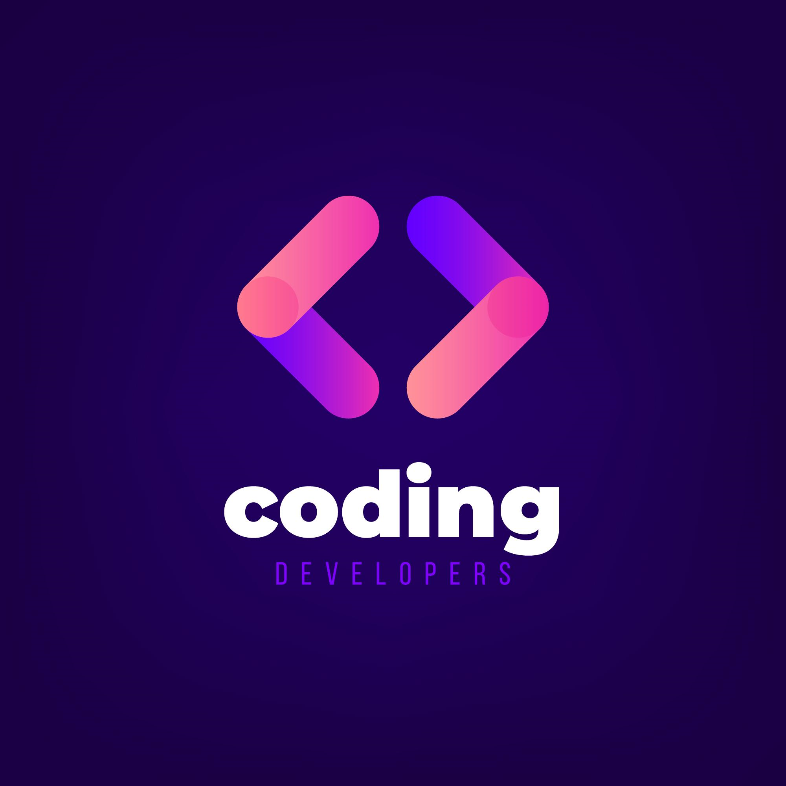
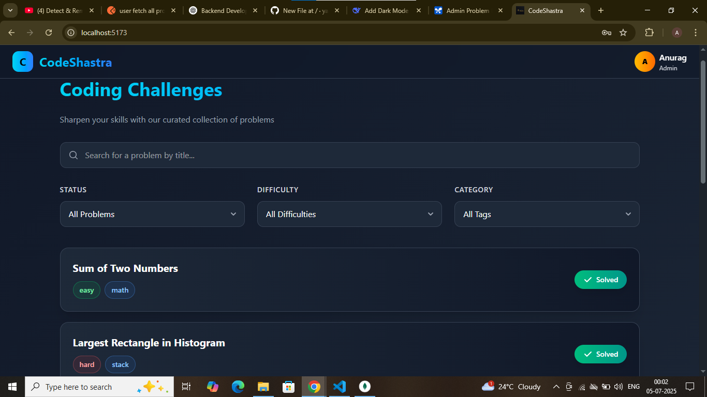
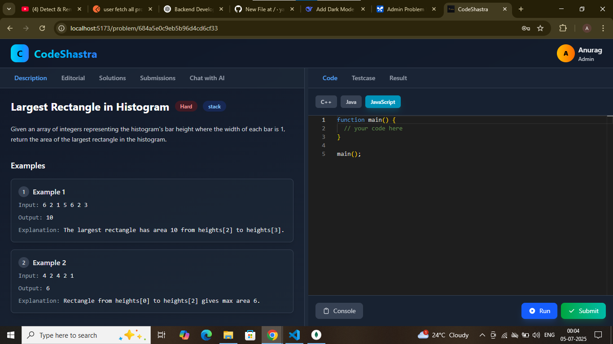
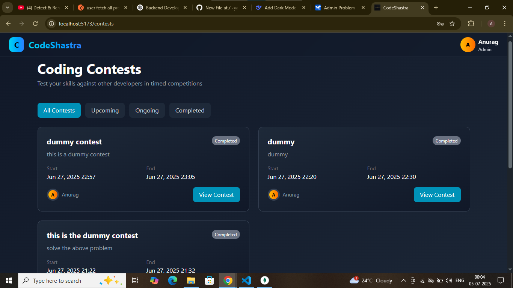
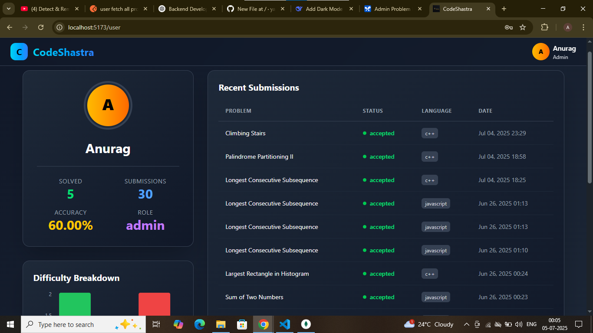
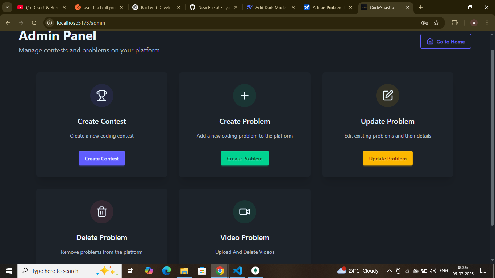

# CodeShastra - Coding Challenge Platform

<p align="center">
  
</p>

## Table of Contents
- [Project Overview](#project-overview)
- [Key Features](#key-features)
- [Screenshots](#screenshots)
- [Technology Stack](#technology-stack)
- [Installation Guide](#installation-guide)
- [Project Structure](#project-structure)
- [API Documentation](#api-documentation)
- [Contribution Guidelines](#contribution-guidelines)
- [License](#license)

## Project Overview
CodeShastra is a comprehensive coding challenge platform designed to help developers sharpen their skills through curated problems, contests, and learning resources. The platform features:

- Curated collection of coding problems with varying difficulty levels
- Coding contests with leaderboards and rankings
- Detailed problem explanations and video solutions
- User profiles with submission history and statistics
- Admin panel for content management

## Key Features

### User Features
- **Problem Solving**: Solve coding challenges with built-in editor
- **Contest Participation**: Join timed coding competitions
- **Profile Tracking**: View solved problems and submission history
- **Video Solutions**: Learn from video explanations
- **Leaderboards**: Compare performance with other developers

### Admin Features
- **Problem Management**: Create/update/delete coding problems
- **Contest Management**: Schedule and manage coding contests
- **Video Management**: Upload/delete video solutions
- **Content Management**: Full control over platform content
- **User Insights**: View user activity and statistics

## Screenshots

### Problem Listing Page

*Browse coding challenges by difficulty and category*

### Problem Detail Page

*View problem details, examples, and submit solutions*

### Contest Management

*Create and manage coding competitions with start/end dates*

### User Profile

*View solved problems, submission history, and accuracy statistics*

### Admin Panel

*Manage problems, contests, and video solutions*

## Technology Stack

### Frontend
- **React.js** - Core UI framework
- **Redux** - State management
- **Tailwind CSS** - Styling framework
- **DaisyUI** - UI component library
- **React Router** - Navigation
- **Monaco Editor** - Code editor
- **Axios** - API communication

### Backend
- **Node.js** - Runtime environment
- **Express.js** - Web framework
- **MongoDB** - Database
- **Mongoose** - ODM for MongoDB
- **JSON Web Tokens** - Authentication
- **Cloudinary** - Video storage
- **Judge0** - Code execution engine

### DevOps
- **Docker** - Containerization
- **GitHub Actions** - CI/CD
- **AWS** - Hosting

## Installation Guide

### Prerequisites
- Node.js v16+
- MongoDB v5+
- npm v8+

### Setup Instructions

1. **Clone the repository**:
   ```bash
   git clone https://github.com/yourusername/codeshastra.git
   cd codeshastra
   ```

2. **Set up backend**:
   ```bash
   cd backend
   npm install
   cp .env.example .env
   # Update .env with your credentials
   ```

3. **Set up frontend**:
   ```bash
   cd ../frontend
   npm install
   cp .env.example .env
   # Update .env with your API endpoint
   ```

4. **Start the application**:
   ```bash
   # Start backend
   cd ../backend
   npm start
   
   # Start frontend
   cd ../frontend
   npm start
   ```

5. **Access the application**:
   - User interface: `http://localhost:3000`
   - Admin panel: `http://localhost:3000/admin`

## Project Structure

```
codeshastra/
├── backend/               # Backend server
│   ├── controllers/       # Route controllers
│   ├── models/            # MongoDB models
│   ├── routes/            # API routes
│   ├── utils/             # Utility functions
│   ├── app.js             # Express application
│   └── server.js          # Server entry point
│
├── frontend/              # React application
│   ├── public/            # Static assets
│   ├── src/               # Source code
│   │   ├── components/    # Reusable components
│   │   ├── pages/         # Application pages
│   │   ├── utils/         # Utility functions
│   │   ├── App.js         # Main application component
│   │   └── index.js       # Entry point
│   └── package.json       # Frontend dependencies
│
├── assets/                # Images and media files
├── docker-compose.yml     # Docker configuration
├── LICENSE                # Project license
└── README.md              # Project documentation
```

## API Documentation

The backend API follows RESTful principles. Key endpoints include:

### Problem Management
- `GET /problem/getAllProblem` - List all problems
- `GET /problem/problemById/:id` - Get problem by ID
- `PUT /problem/:id` - Update problem
- `DELETE /problem/delete/:id` - Delete problem

### Contest Management
- `POST /contest` - Create new contest
- `GET /contest` - List all contests
- `GET /contest/:id` - Get contest details

### User Management
- `POST /auth/register` - Register new user
- `POST /auth/login` - User login
- `GET /user/profile` - Get user profile

### Video Management
- `POST /video/save` - Save video metadata
- `GET /video/create/:problemId` - Get video upload signature
- `DELETE /video/delete/:id` - Delete video

Full API documentation available at `/api-docs` when running locally.

## Contribution Guidelines

We welcome contributions! Please follow these steps:

1. Fork the repository
2. Create a new branch (`git checkout -b feature/your-feature`)
3. Commit your changes (`git commit -am 'Add some feature'`)
4. Push to the branch (`git push origin feature/your-feature`)
5. Open a pull request

### Coding Standards
- Follow existing code style and patterns
- Write meaningful commit messages
- Include comments for complex logic
- Update documentation when necessary
- Ensure all tests pass before submitting

## License

CodeShastra is [MIT licensed](LICENSE).

---

**Developed by Anurag**  
*For educational purposes*  
© 2025 CodeShastra Project
